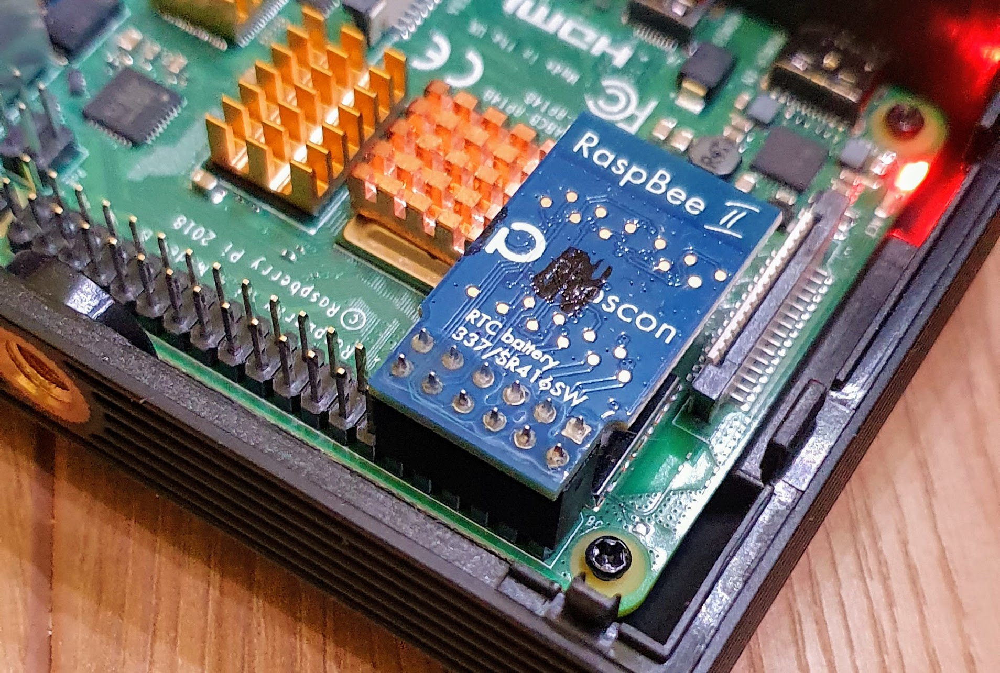
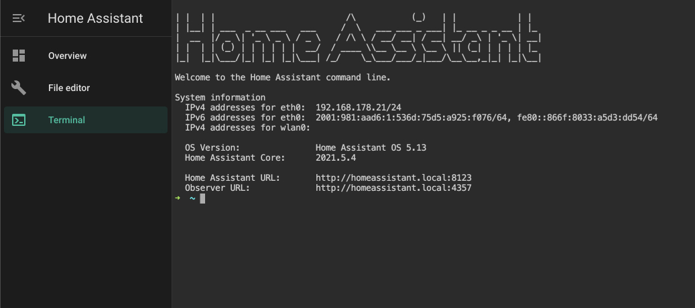
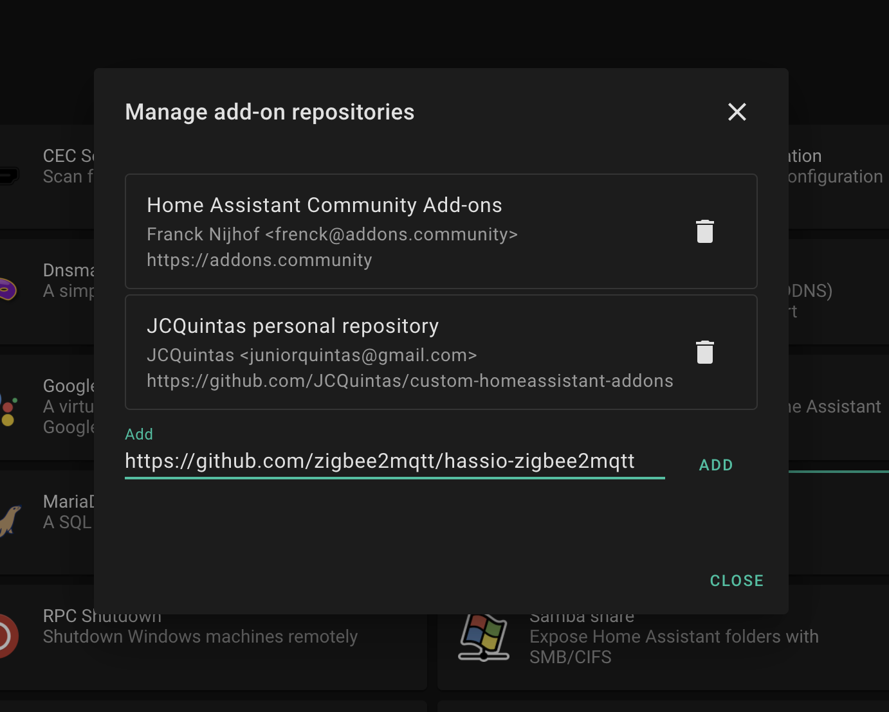
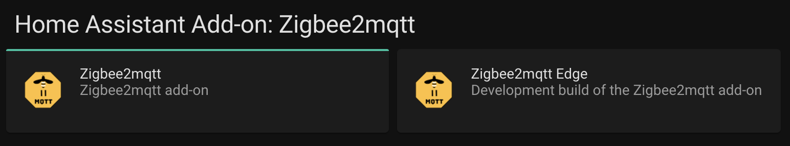
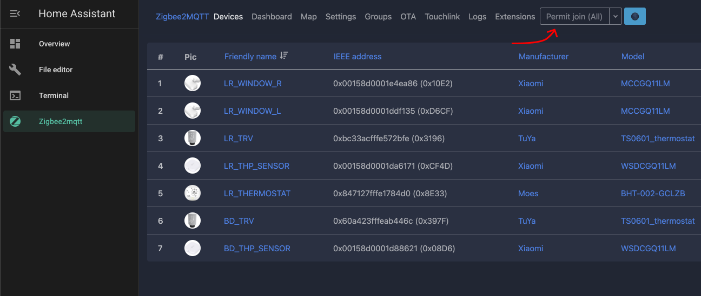

Recently I've been using [Home Assistant](https://www.home-assistant.io/) installed on a [RaspberryPi 4](https://www.raspberrypi.org/products/raspberry-pi-4-model-b/) to handle a lot of my IoT and smart devices. Instead of buying Zigbee routers for every brand and having a mess of bridges, I've opted to buy a [RaspBee II](https://phoscon.de/en/raspbee2). But I struggled a lot to set it up using the [zigbee2mqtt](https://www.zigbee2mqtt.io/) addon. Luckily for you, I've documented my struggles so you can have an easier time.

## Installing the RaspBee II

In order to install the RaspBee on your RaspberryPi, simply follow the documentation on the [official website](https://phoscon.de/en/raspbee2/install#connection).

Keep in mind that the RaspBee should be installed on the first pins in the board. You can see an example on the picture below.



## Configuring the RaspberryPi

In order for the RaspberryPi to use the correct addresses for the RaspBee device, you need to change the `config.txt` where the operating system is installed, usually in a SD card. For this, you will likely need to remove the SD card and edit the file on another system.

The changes you want to make are pretty simple, but keep in mind if you are using a `RaspberryPi 3` you should use `pi3-miniuart-bt` instead of `miniuart-bt` on the example below.

```bash
enable_uart=1
dtoverlay=miniuart-bt
```

<blockquote>You might need to use <code>pi3-miniuart-bt</code> if on rp3 but readers also reported that it only worked with <code>miniuart-bt</code> so make sure to try both.</blockquote>

## SSH Access & Certificates

In order to generate a `certificate` to use in in the `Mosquitto broker` addon, it is easier if you have SSH access to the instance. You can use the [SSH & Web Terminal](https://github.com/hassio-addons/addon-ssh) add-on, then enable `Show in sidebar`.

You can then click on the sidebar (picture below), or setup a `username` and `password` on the addon and connect it through SSH using `ssh username@homeassistant.local` from your local terminal, accept the security prompt, then input your password when asked for it.



After gaining access to the Home Assistant terminal, run the following command to generate a `key/cert` pair for `mqtt` and follow the prompts.

```bash
openssl req -newkey rsa:2048 -new \
  -nodes -x509 -days 3650 \
  -keyout ssl/mqtt_key.pem \
  -out ssl/mqtt_cert.pem
```

Your certificate and key will be created on the `ssl` folder, which is where most applications look for them.

## The Mosquitto broker

Simply install the [Mosquitto broker](https://github.com/home-assistant/addons/tree/master/mosquitto) add-on. This will create a sort of `mosquitto server` to handle the `mqtt` requests coming from `zigbee2mqtt`.

You will need to configure it to use the new certs you just generated on the previous step. Keep in mind the addon looks for the certificates inside the `ssl` folder, so you can omit that.

```yaml
certfile: mqtt_cert.pem
keyfile: mqtt_key.pem
```

When you start this addon, a new `Mosquitto broker` integration will pop up on `Configuration -> Integrations`, enable it to automatically detect new `mqtt` entities when they become visible on your system.

## Zigbee2mqtt

Finally, in order to properly connect your devices you will need the [zigbee2mqtt addon](https://github.com/zigbee2mqtt/hassio-zigbee2mqtt). Though it is not an official addon, so you will need to do an additional step for it to show up to you.

You will need to add the repository URL on the link above into the `Supervisor → Add-on store → ⋮ → Manage add-on repositories`



Then the addon will appear on its own section as show below. After installing it, proceed to the next steps.



## Configuring Zigbee2mqtt addon

If you followed all steps until now, we should be almost done with the setup, the last thing necessary is to add the correct `port` and `adapter` to the addon config. You will want the `port` to be `/dev/ttyAMA0`, which is where your RaspBee II is located, and the adapter to use to be `deconz` since, they are the manufacturer of the RaspBee.

```yaml
serial:
  port: /dev/ttyAMA0
  adapter: deconz
```

That should be it, after the addon is turned on, you can go the web ui and start adding your devices.

## Adding a new device

To add a new device you will need to go the `Zigbee2mqtt` web interface, if you don't see it on your sidebar, you will need to enable it on the addon's settings. When you access the page, you can press the `Permit join (all)` button, highlighted on the picture below.

Then make sure the device you want to add is in pairing mode. If you don't know exactly how to do it, try checking the manual, but usually the [zigbee2mqtt supported devices](https://www.zigbee2mqtt.io/information/supported_devices.html) page is quite useful in telling you how to enable pair mode on the devices they support.

Once your device is detected, it will start a handshake and a green popup will show in the UI, after a few seconds your device should be added to the list of devices.



That is it, you have a working setup now. If you still can't connect or have other problems, try the troubleshooting step below, or open an issue on this [blog's repository](https://github.com/JCQuintas/mind-components/issues) and I will try my best to help you out.

## Troubleshooting

If devices can't pair, try changing the channel to one of the other available channels.

```yaml
advanced:
  channel: 11 # 11, 15, 20, or 25
```
